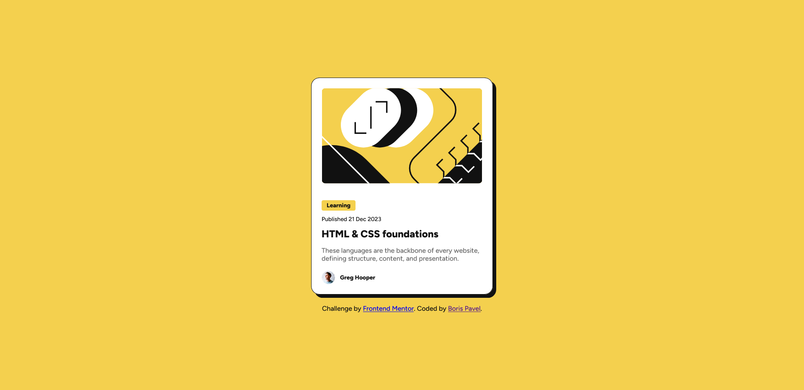

# Frontend Mentor - Blog preview card solution

This is a solution to the [Blog preview card challenge on Frontend Mentor](https://www.frontendmentor.io/challenges/blog-preview-card-ckPaj01IcS). Frontend Mentor challenges help you improve your coding skills by building realistic projects.

## Table of contents

- [Overview](#overview)
  - [The challenge](#the-challenge)
  - [Screenshot](#screenshot)
  - [Links](#links)
- [My process](#my-process)
  - [Built with](#built-with)
  - [What I learned](#what-i-learned)
  - [Continued development](#continued-development)
  - [Useful resources](#useful-resources)
- [Author](#author)
- [Acknowledgments](#acknowledgments)

## Overview

### The challenge

Users should be able to:

- See hover and focus states for all interactive elements on the page

### Screenshot

### Links

- Solution URL: [Add your solution URL here](https://your-solution-url.com)
- Live Site URL: [Add your live site URL here](https://your-live-site-url.com)

## My process

### Built with

- Semantic HTML5 markup
- CSS custom properties
- Flexbox
- Mobile-first workflow
- Local webfonts (Figtree)

### What I learned

- How to use custom properties for color and font management
- How to implement accessible hover and focus states for interactive elements
- Responsive design using media queries and flexible layouts

### Continued development

- Explore adding subtle animations to interactive elements
- Improve accessibility further (e.g., ARIA roles, keyboard navigation)
- Experiment with CSS Grid for more complex layouts

### Useful resources

- [Frontend Mentor](https://www.frontendmentor.io/) - Challenge platform
- [MDN Web Docs](https://developer.mozilla.org/) - Reference for HTML and CSS
- [CSS Tricks](https://css-tricks.com/) - Tips and guides for modern CSS

## Author

- LinkedIn - [Boris Pavel](https://www.linkedin.com/in/boris-pavel/)
- Frontend Mentor - [@boris-pavel](https://www.frontendmentor.io/profile/yourusername)

## Acknowledgments

Thanks to the Frontend Mentor community for feedback and support!
